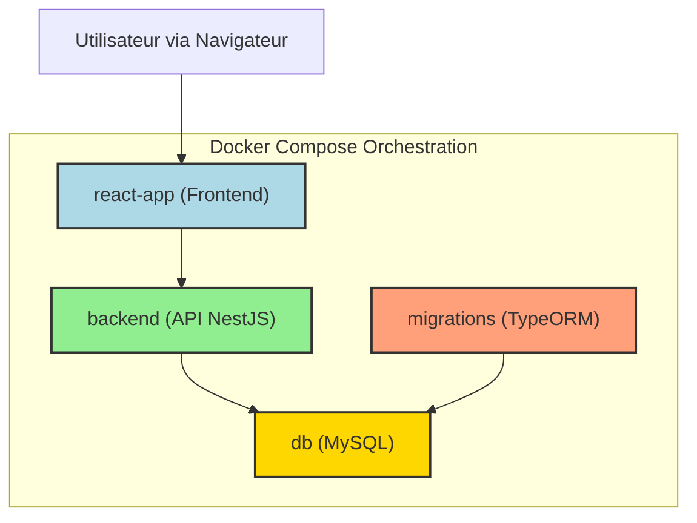

<!-- _class: lead -->
# Conteneurisation de PixelWar avec Docker

---

# Introduction à PixelWar

*   **PixelWar** est une application web collaborative de pixel art en temps réel.
*   Permet à plusieurs utilisateurs de dessiner simultanément sur une toile partagée.
*   **Architecture microservices:**
    *   Frontend: React (`react-app`)
    *   Backend: NestJS (API REST) (`backend`)
    *   Base de données: MySQL (`db`)
    *   Migrations: TypeORM (`migrations`)

---

# Pourquoi Docker pour PixelWar?

*   **Environnements Cohérents:** Identiques pour tous les développeurs et pour la production.
*   **Isolation des Services:** Chaque composant (frontend, backend, DB) s'exécute dans son propre conteneur.
*   **Déploiement Simplifié:** Facilite le passage du développement à la production.
*   **Gestion des Dépendances:** Chaque service a ses propres dépendances, évitant les conflits.
*   **Scalabilité:** Prépare le terrain pour une mise à l'échelle future.

---

# Architecture des Services Dockerisés


* Le `docker-compose.yml` définit et gère ces services.

---

# `front/Dockerfile` - Vue d'Ensemble

*   **Multi-stage build** pour optimiser la taille de l'image finale et séparer les préoccupations :
    1.  Étape `development`: Base pour le développement avec hot-reload.
    2.  Étape `build`: Compile l'application React pour la production.
    3.  Étape `production`: Image finale légère avec Nginx pour servir les fichiers statiques.

---

# `front/Dockerfile` - Étape `development`

```dockerfile
# front/Dockerfile (Étape Development)

# Utilise une image Node.js 18 basée sur Alpine Linux (légère)
FROM node:18-alpine AS development

# Définit le répertoire de travail dans le conteneur
WORKDIR /app

# Copie package.json et package-lock.json (ou yarn.lock)
# Ceci est fait avant de copier le reste du code pour tirer parti du cache Docker.
# Si ces fichiers ne changent pas, Docker réutilise la couche d'installation des dépendances.
COPY package*.json ./

# Installer les dépendances du projet
# Pour le développement, 'npm install' est courant.
# Pour les builds, 'npm ci' est préférable (voir étape build).
RUN npm install

# Note: Le code source n'est PAS copié ici dans l'étape de développement.
# En mode développement, le code source sera monté via un volume Docker
# depuis la machine hôte pour permettre le hot-reload.

# Commande par défaut pour démarrer le serveur de développement React
# Cette commande sera exécutée lorsque le conteneur démarrera (si non surchargée).
CMD ["npm", "start"]
```

---

# `front/Dockerfile` - Étape `build`

```dockerfile
# front/Dockerfile (Étape Build)

# Continue à partir d'une image Node.js 18 Alpine, nommée 'build'
FROM node:18-alpine AS build

WORKDIR /app

COPY package*.json ./
# Utilise npm ci (Clean Install) pour une installation de dépendances plus stricte et reproductible,
# souvent préférée pour les environnements de build et CI/CD.
# Elle utilise le package-lock.json pour garantir les mêmes versions de dépendances.
RUN npm ci

# Copie l'ensemble du code source de l'application dans le conteneur
# Ceci est nécessaire pour que le processus de build ait accès à tous les fichiers.
COPY . .

# Exécute le script de build de l'application React (défini dans package.json)
# Cela génère généralement les fichiers statiques optimisés dans un dossier 'build'.
RUN npm run build
```

---

# `front/Dockerfile` - Étape `production`

```dockerfile
# front/Dockerfile (Étape Production)

# Utilise une image Nginx légère basée sur Alpine pour servir les fichiers statiques
FROM nginx:alpine AS production

# Optionnel: Copier une configuration Nginx personnalisée si nécessaire
# COPY nginx.conf /etc/nginx/conf.d/default.conf

# Copie les fichiers build de l'étape 'build' précédente (où l'application React a été construite)
# dans le répertoire par défaut servi par Nginx (/usr/share/nginx/html).
# C'est le cœur du multi-stage build : on ne garde que les artefacts nécessaires.
COPY --from=build /app/build /usr/share/nginx/html

# Expose le port 80, qui est le port par défaut sur lequel Nginx écoute.
EXPOSE 80

# Healthcheck pour vérifier que le serveur Nginx fonctionne correctement.
# Tente de récupérer la page d'accueil toutes les 30s.
HEALTHCHECK --interval=30s --timeout=10s --start-period=5s --retries=3 \
  CMD wget -qO- http://localhost/ || exit 1

# Nginx démarre automatiquement lorsque le conteneur est lancé.
# Pas besoin de CMD explicite ici, car l'image Nginx de base en a déjà un.
```

---

# `api-rest-nestjs/Dockerfile` - Vue d'Ensemble

*   **Multi-stage build** également :
    1.  Étape `development`: Base pour le développement avec hot-reload pour NestJS.
    2.  Étape `production`: Image optimisée pour la production, contenant uniquement le code compilé et les dépendances de production.

---

# `api-rest-nestjs/Dockerfile` - Étape `development`

```dockerfile
# api-rest-nestjs/Dockerfile (Étape Development)

FROM node:18-alpine AS development # Image de base Node.js

WORKDIR /usr/src/app # Répertoire de travail pour l'API

COPY package*.json ./ # Copie des fichiers de dépendances

# Installation de toutes les dépendances, y compris les devDependencies
# nécessaires pour le hot-reload et les outils de développement NestJS.
RUN npm install

# Le code source sera monté via un volume pour le hot-reload.
# La compilation TypeScript est gérée à la volée par la CLI NestJS en mode dev.

# Commande pour lancer l'application en mode développement (avec hot-reload)
CMD ["npm", "run", "start:dev"]
```

---

# `api-rest-nestjs/Dockerfile` - Étape `production`

```dockerfile
# api-rest-nestjs/Dockerfile (Étape Production)

FROM node:18-alpine AS production

# Argument de build pour définir l'environnement, par défaut à 'production'
ARG NODE_ENV=production
# Variable d'environnement dans le conteneur, basée sur l'argument de build
ENV NODE_ENV=${NODE_ENV}

WORKDIR /usr/src/app

COPY package*.json ./

# Installe UNIQUEMENT les dépendances de production.
# --only=production (ou --omit=dev) exclut les devDependencies.
RUN npm ci --only=production

# Pour une image de production propre, il est préférable d'avoir une étape de 'build' dédiée
# qui compile le TypeScript en JavaScript, puis de copier uniquement le dossier 'dist'
# et les 'node_modules' de production.
# Exemple (si une étape 'build_api' existe) :
# COPY --from=build_api /usr/src/app/dist ./dist
# COPY --from=build_api /usr/src/app/node_modules ./node_modules
# Si vous compilez ici :
COPY . . # Copie tout le code source
RUN npm run build # Assurez-vous que ce script compile bien en JS dans 'dist'

EXPOSE 3001 # Port sur lequel l'application backend écoute

# Commande pour exécuter l'application compilée avec Node.js
CMD ["node", "dist/main"] # 'dist/main' est le point d'entrée typique d'une app NestJS compilée

# Healthcheck pour vérifier que l'API NestJS répond
HEALTHCHECK --interval=30s --timeout=10s --start-period=40s --retries=3 \
  CMD wget -qO- http://localhost:3001/health || exit 1 # Suppose un endpoint /health
```

---

# `docker-compose.yml` - Orchestration

*   Définit et gère les services multi-conteneurs de PixelWar.
*   Services: `db` (MySQL), `backend` (NestJS), `migrations`, `react-app` (Frontend).
*   Gère les réseaux, volumes, variables d'environnement, dépendances entre services.

```yaml
version: '3.8' # Spécifie la version du format Docker Compose

services:
  # ... définitions des services ci-dessous ...

networks: # Définit les réseaux personnalisés
  pixelwar_network: # Nom du réseau
    driver: bridge # Type de réseau par défaut, permet la communication entre conteneurs

volumes: # Définit les volumes nommés pour la persistance des données
  mysql_data: {} # Déclare un volume nommé 'mysql_data' que Docker gérera
  node_modules_front: {} # Volume pour les node_modules du frontend React
```

---

# `docker-compose.yml` - Service `db` (MySQL)

```yaml
# docker-compose.yml (Service db)
services:
  db:
    image: mysql:8.0 # Utilise l'image officielle MySQL version 8.0
    container_name: pixelwar-mysql # Nom explicite pour le conteneur
    restart: always # Politique de redémarrage : toujours redémarrer si le conteneur s'arrête
    environment: # Variables d'environnement pour configurer MySQL
      MYSQL_ROOT_PASSWORD: ${MYSQL_ROOT_PASSWORD:-root} # Mot de passe root (utilise une variable d'env de l'hôte ou 'root' par défaut)
      MYSQL_DATABASE: ${DB_DATABASE} # Nom de la base de données (depuis .env)
      MYSQL_USER: ${DB_USERNAME} # Utilisateur de la base de données (depuis .env)
      MYSQL_PASSWORD: ${DB_PASSWORD} # Mot de passe de l'utilisateur (depuis .env)
    ports:
      - "3306:3306" # Mappe le port 3306 de la machine hôte au port 3306 du conteneur
    volumes:
      - mysql_data:/var/lib/mysql # Monte le volume nommé 'mysql_data' pour persister les données MySQL
    networks:
      - pixelwar_network # Connecte le service au réseau personnalisé 'pixelwar_network'
    # Commande pour MySQL, spécifiant le plugin d'authentification et l'encodage
    command: --default-authentication-plugin=mysql_native_password --character-set-server=utf8mb4 --collation-server=utf8mb4_unicode_ci
    labels: # Métadonnées pour le service (optionnel, utile pour l'organisation)
      com.pixelwar.description: "MySQL database for PixelWar application"
    healthcheck: # Définit comment vérifier la santé du service MySQL
      # Teste si 'mysqladmin ping' réussit avec les identifiants fournis
      test: ["CMD", "mysqladmin", "ping", "-h", "localhost", "-u", "${DB_USERNAME}", "-p${DB_PASSWORD}"]
      interval: 10s # Intervalle entre les vérifications
      timeout: 5s # Temps d'attente maximal pour une vérification
      retries: 5 # Nombre de tentatives avant de marquer comme 'unhealthy'
```

---

# `docker-compose.yml` - Service `backend` (NestJS)

```yaml
# docker-compose.yml (Service backend)
services:
  backend:
    build: # Indique que l'image doit être construite à partir d'un Dockerfile
      context: ./api-rest-nestjs # Chemin vers le répertoire contenant le Dockerfile et le code source de l'API
      dockerfile: Dockerfile # Nom du Dockerfile à utiliser (par défaut Dockerfile)
      target: development # Cible l'étape 'development' du Dockerfile multi-stage
    container_name: pixelwar-backend
    ports:
      - "3001:3001" # Mappe le port 3001 de l'hôte au port 3001 du conteneur (où NestJS écoute)
    volumes: # Gestion des volumes pour le hot-reload
      # Monte le code source local de l'API dans le conteneur.
      # Les modifications sur l'hôte sont reflétées dans le conteneur.
      - ./api-rest-nestjs:/usr/src/app
      # Volume anonyme pour isoler node_modules du conteneur.
      # Empêche le node_modules de l'hôte (s'il existe) d'écraser celui du conteneur.
      - /usr/src/app/node_modules
    depends_on: # Définit les dépendances de démarrage
      db: # Le service 'backend' dépend du service 'db'
        condition: service_healthy # Attend que le service 'db' soit marqué comme 'healthy' par son healthcheck
    environment: # Variables d'environnement pour l'application backend
      - NODE_ENV=development
      - DB_HOST=db # Nom du service de base de données sur le réseau Docker (DNS interne de Docker)
      - DB_PORT=3306
      - DB_USERNAME=${DB_USERNAME} # Récupère depuis le .env de l'hôte
      - DB_PASSWORD=${DB_PASSWORD}
      - DB_DATABASE=${DB_DATABASE}
    networks:
      - pixelwar_network
    labels:
      com.pixelwar.description: "NestJS backend API for PixelWar application"
```

---

# `docker-compose.yml` - Service `migrations`

```yaml
# docker-compose.yml (Service migrations)
services:
  migrations:
    build: # Utilise la même configuration de build que le backend pour avoir accès aux mêmes dépendances et code
      context: ./api-rest-nestjs
      dockerfile: Dockerfile
      target: development # Ou une étape optimisée si les migrations n'ont pas besoin de toutes les devDependencies
    container_name: pixelwar-migrations
    working_dir: /usr/src/app # Définit le répertoire de travail pour la commande
    volumes: # Monte le code et le fichier .env pour que les scripts de migration aient la bonne configuration
      - ./api-rest-nestjs:/usr/src/app
      - ./.env:/usr/src/app/.env # Assure que les variables d'environnement pour la DB sont lues
    # Commande pour installer les dépendances (si non déjà dans l'image/volume) et exécuter les migrations TypeORM
    # 'sh -c' permet d'exécuter plusieurs commandes.
    # 'npm install' peut être omis si les node_modules sont déjà gérés correctement par les volumes/image.
    # '-d src/migration-config.ts' spécifie le chemin vers la configuration de la source de données TypeORM.
    command: sh -c "npm install && npx typeorm-ts-node-commonjs migration:run -d src/migration-config.ts"
    depends_on: # Dépend de la base de données et potentiellement du backend (si les migrations dépendent de l'état de l'API)
      db:
        condition: service_healthy # Attend que la DB soit prête
      backend: # Optionnel, dépend si les migrations doivent attendre que le backend ait démarré (rare)
        condition: service_started # Attend juste que le conteneur backend ait démarré
    environment: # Variables d'environnement pour la connexion DB, redondant si .env est monté et lu correctement
      - NODE_ENV=development
      - DB_HOST=db
      - DB_PORT=3306
      - DB_USERNAME=${DB_USERNAME}
      - DB_PASSWORD=${DB_PASSWORD}
      - DB_DATABASE=${DB_DATABASE}
    networks:
      - pixelwar_network
    labels:
      com.pixelwar.type: "one-shot" # Indique un conteneur qui s'exécute une fois puis s'arrête
```

---

# `docker-compose.yml` - Service `react-app` (Frontend)

```yaml
# docker-compose.yml (Service react-app)
services:
  react-app:
    build:
      context: ./front # Chemin vers le code source du frontend
      dockerfile: Dockerfile
      target: development # Cible l'étape 'development' du Dockerfile frontend
    container_name: pixelwar-frontend
    ports:
      - "3000:3000" # Mappe le port 3000 (serveur de dev React)
    volumes: # Gestion des volumes pour le hot-reload
      - ./front:/app # Monte le code source local du frontend
      # Utilise un volume NOMMÉ pour les node_modules. Cela les isole de l'hôte,
      # assure la compatibilité avec l'environnement du conteneur (Alpine),
      # et persiste les node_modules entre les redémarrages, optimisant les lancements.
      - node_modules_front:/app/node_modules
    environment:
      - NODE_ENV=development
      # CHOKIDAR_USEPOLLING=true est souvent nécessaire pour que la surveillance des fichiers
      # (utilisée par Webpack Dev Server pour le hot-reload) fonctionne correctement
      # dans un environnement conteneurisé avec des volumes montés, surtout sur certains OS.
      - CHOKIDAR_USEPOLLING=true
      - REACT_APP_API_URL=http://localhost:3001 # URL de l'API backend, accessible depuis le navigateur de l'utilisateur
    networks:
      - pixelwar_network
    depends_on: # Dépend du backend pour que l'API soit (potentiellement) disponible au démarrage
      - backend # Le frontend peut démarrer même si le backend n'est pas encore 100% prêt, mais l'API ne fonctionnera pas
    labels:
      com.pixelwar.description: "React frontend for PixelWar application"
```
*   **`build.target: development`**: Utilise l'étape `development` du `front/Dockerfile`.
*   **`volumes`**:
    *   `./front:/app`: Monte le code source local pour le hot-reload.
    *   `node_modules_front:/app/node_modules`: Utilise un volume **nommé** pour les `node_modules`. Cela les isole de l'hôte, assure la compatibilité avec l'environnement du conteneur (Alpine), et persiste les `node_modules` entre les redémarrages, potentiellement accélérant les lancements ultérieurs.
*   **`CHOKIDAR_USEPOLLING=true`**: Souvent nécessaire pour que les systèmes de surveillance de fichiers (comme celui de Webpack Dev Server) fonctionnent correctement dans un environnement conteneurisé avec des volumes montés.

---

# Hot Reload en Détail

*   **Principe**: Modifier le code sur la machine hôte et voir les changements reflétés instantanément dans l'application exécutée dans le conteneur, sans redémarrer/reconstruire le conteneur.
*   **Configuration Clé (`docker-compose.yml` pour `react-app` ou `backend`):**
    ```yaml
    volumes:
      - ./chemin/vers/code/local:/chemin/dans/conteneur  # 1. Bind mount du code source
      # 2. Isolation des node_modules (anonyme ou nommé)
      #    Ex: /app/node_modules (anonyme, pour le backend dans notre cas)
      #    Ex: node_modules_front:/app/node_modules (nommé, comme dans notre config optimisée pour React)
    ```
    1.  Le code source de votre machine est directement "monté" dans le conteneur. Les modifications sont donc immédiatement visibles par le processus du conteneur.
    2.  Les `node_modules` installés dans l'image Docker (via `RUN npm install` dans le Dockerfile) sont préservés. L'utilisation d'un volume (anonyme ou **nommé** comme `node_modules_front`) pour le dossier `node_modules` du conteneur est une optimisation : il "masque" le dossier `node_modules` qui pourrait être présent dans le code source monté, garantissant que le conteneur utilise ses propres `node_modules` (compilés pour l'OS du conteneur, ex: Alpine) et les persiste de manière gérée par Docker.
*   **Outils de Développement**:
    *   NestJS (`npm run start:dev`) et React (`npm start` via `react-scripts`) intègrent des serveurs de développement qui surveillent les changements de fichiers.
    *   `CHOKIDAR_USEPOLLING=true` (pour React/Webpack) peut être nécessaire pour la détection des changements via les volumes montés, car le mécanisme par défaut (événements inotify) peut ne pas bien fonctionner à travers les couches de virtualisation des volumes.

---

# Gestion des Données & Migrations

*   **Persistance des Données MySQL:**
    *   Utilisation d'un **volume nommé** `mysql_data` dans `docker-compose.yml`:
        ```yaml
        services:
          db:
            volumes:
              - mysql_data:/var/lib/mysql # Monte 'mysql_data' dans le chemin de données de MySQL
        volumes: # Section globale à la racine du docker-compose.yml
          mysql_data: {} # Docker le gère.
        ```
    *   Les données de la base (`/var/lib/mysql` dans le conteneur) survivent même si le conteneur `db` est supprimé et recréé.

*   **Migrations de Base de Données:**
    *   Le service `migrations` est un conteneur "one-shot" (il s'exécute puis s'arrête).
    *   Il exécute les scripts de migration TypeORM (`npm run migration:run` ou équivalent) après que la base de données soit saine (`service_healthy`).
    *   Assure que le schéma de la base de données est à jour avant que l'application backend ne l'utilise pleinement.

---

# Commandes Docker Quotidiennes pour PixelWar

*   **Démarrer tous les services (en arrière-plan, reconstruire si Dockerfile ou contexte a changé):**
    ```bash
    docker-compose up -d --build
    ```
*   **Arrêter tous les services:**
    ```bash
    docker-compose down
    ```
*   **Arrêter et supprimer les volumes nommés (attention, supprime les données MySQL et `node_modules_front`!):**
    ```bash
    docker-compose down -v
    ```
*   **Voir les logs d'un service (ex: backend) en continu:**
    ```bash
    docker-compose logs -f backend
    ```
*   **Exécuter une commande dans un conteneur en cours (ex: shell dans le backend):**
    ```bash
    docker-compose exec backend sh  # Ou bash si disponible dans l'image
    ```
*   **Lister les conteneurs en cours d'exécution gérés par Compose:**
    ```bash
    docker-compose ps
    ```
*   **Forcer la reconstruction des images sans utiliser le cache Docker:**
    ```bash
    docker-compose build --no-cache
    ```
*   **Exécuter manuellement le service de migrations (s'il est configuré pour ne pas s'exécuter au `up`):**
    ```bash
    docker-compose run --rm migrations # --rm supprime le conteneur après exécution
    ```

---

# Conclusion & Bénéfices pour PixelWar

*   **Environnement de Développement Unifié:** Simplifie l'onboarding et réduit les problèmes de type "ça marche sur ma machine".
*   **Cycle de Développement Accéléré:** Grâce au hot-reload et à la facilité de gestion des services.
*   **Isolation et Stabilité:** Chaque service est indépendant, réduisant les interférences.
*   **Préparation pour la Production:** Les Dockerfiles multi-stage facilitent la création d'images de production optimisées et sécurisées.
*   **Infrastructure en tant que Code:** `docker-compose.yml` et les `Dockerfile`s documentent et versionnent l'architecture de l'application.

## Pistes d'Amélioration (issues du prompt Gamma)
*   Utilisation de SQLite pour les environnements de test.
*   Fichiers `docker-compose.override.yml` pour les configurations locales et `docker-compose.prod.yml` pour la production.
*   Intégration CI/CD complète pour automatiser les builds et déploiements.

---

<!-- _class: invert -->
# Questions ?

---

# Gestion des Données & Migrations

*   **Persistance des Données MySQL:**
    *   Utilisation d'un **volume nommé** `mysql_data` dans `docker-compose.yml`:
        ```yaml
        services:
          db:
            volumes:
              - mysql_data:/var/lib/mysql # Monte 'mysql_data' dans le chemin de données de MySQL
        volumes: # Section globale à la racine du docker-compose.yml
          mysql_data: {} # Docker le gère.
        ```
    *   Les données de la base (`/var/lib/mysql` dans le conteneur) survivent même si le conteneur `db` est supprimé et recréé.

*   **Migrations de Base de Données:**
    *   Le service `migrations` est un conteneur "one-shot" (il s'exécute puis s'arrête).
    *   Il exécute les scripts de migration TypeORM (`npm run migration:run` ou équivalent) après que la base de données soit saine (`service_healthy`).
    *   Assure que le schéma de la base de données est à jour avant que l'application backend ne l'utilise pleinement.

---

# Commandes Docker Quotidiennes pour PixelWar

*   **Démarrer tous les services (en arrière-plan, reconstruire si Dockerfile ou contexte a changé):**
    ```bash
    docker-compose up -d --build
    ```
*   **Arrêter tous les services:**
    ```bash
    docker-compose down
    ```
*   **Arrêter et supprimer les volumes nommés (attention, supprime les données MySQL et `node_modules_front`!):**
    ```bash
    docker-compose down -v
    ```
*   **Voir les logs d'un service (ex: backend) en continu:**
    ```bash
    docker-compose logs -f backend
    ```
*   **Exécuter une commande dans un conteneur en cours (ex: shell dans le backend):**
    ```bash
    docker-compose exec backend sh  # Ou bash si disponible dans l'image
    ```
*   **Lister les conteneurs en cours d'exécution gérés par Compose:**
    ```bash
    docker-compose ps
    ```
*   **Forcer la reconstruction des images sans utiliser le cache Docker:**
    ```bash
    docker-compose build --no-cache
    ```
*   **Exécuter manuellement le service de migrations (s'il est configuré pour ne pas s'exécuter au `up`):**
    ```bash
    docker-compose run --rm migrations # --rm supprime le conteneur après exécution
    ```

---

# Conclusion & Bénéfices pour PixelWar

*   **Environnement de Développement Unifié:** Simplifie l'onboarding et réduit les problèmes de type "ça marche sur ma machine".
*   **Cycle de Développement Accéléré:** Grâce au hot-reload et à la facilité de gestion des services.
*   **Isolation et Stabilité:** Chaque service est indépendant, réduisant les interférences.
*   **Préparation pour la Production:** Les Dockerfiles multi-stage facilitent la création d'images de production optimisées et sécurisées.
*   **Infrastructure en tant que Code:** `docker-compose.yml` et les `Dockerfile`s documentent et versionnent l'architecture de l'application.

## Pistes d'Amélioration 
*   Utilisation de SQLite pour les environnements de test.
*   Fichiers `docker-compose.override.yml` pour les configurations locales et `docker-compose.prod.yml` pour la production.
*   Intégration CI/CD complète pour automatiser les builds et déploiements.

---

<!-- _class: invert -->
# Questions ?